# DCC Boxed Node-RED Nodes

[](https://www.gnu.org/licenses/gpl-3.0)
[](https://github.com/SmartDCCInnovation/dccboxed-nodered-nodes/actions/workflows/node.yml)
[](https://badge.fury.io/gh/SmartDCCInnovation%2Fdccboxed-nodered-nodes)

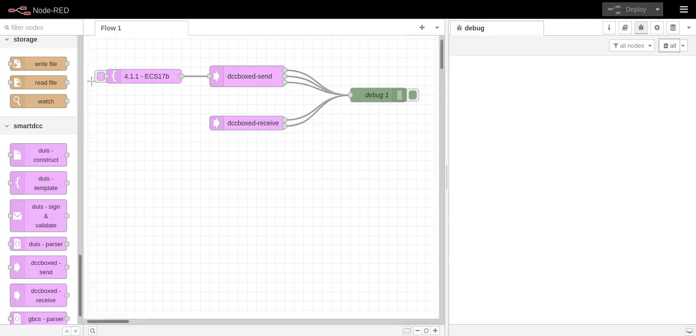

[DCC&nbsp;Boxed][boxed] is a tool for (emulated) end-2-end testing within the UK
smart metering network. This project provides a number of nodes that enable
[Node-RED][nodered] to send and receive requests to a DCC Boxed instance. The
intention is to provide an easy to use tool set to allow users to interface with
DCC&nbsp;Boxed without worrying about technical issues such as xml and correctly
signing commands.

The functionality exposed includes:

  * A library of [DUIS][duis] templates, i.e. commands (taken from RTDS)
  * Send the [DUIS][duis] request to a DCC Boxed (*critical*, *non-critical*,
    *device* and *non-device* supported).
  * Receive a [DUIS][duis] response (both synchronous and asynchronously)
  * Generate and submit UTRN tokens.

These three functions greatly reduce the complexity needed to interface with
DCC&nbsp;Boxed as they hide the cryptographic operations and different request
processing strategies. Thus, allowing the user to focus on the application
layer, e.g. configuring devices or automating business processes.

## Usage

Ensure you are using Node 16x or later. This is because some of the nodes rely
on features in the `crypto` library of Node 16x.

If you have not already, install [*Node-RED*][nodered]. The below assumes that
*Node-RED* is installed globally and not running in a sandbox/docker. The nodes
in the project are developed and tested against version 3.0.2 of *Node-RED*.

Install `@smartdcc/dccboxed-nodered-nodes` package into *Node-RED*'s palette
using the [standard process][palette]. See below image for an example of
installing from the user interface.

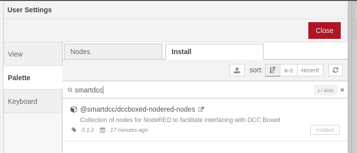

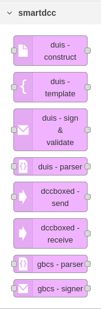

Once installed, it should make available a number of purple nodes under the
`smartdcc` category (see image to right).

**Note:** To use "*duis - sign & validate*", "*dccboxed-send*" or
"*dccboxed-receive*" nodes it is required to install *Java* (developed and
tested against Java&nbsp;11). This means, that `java` should be in the `PATH` of
the *Node-RED* application. For this reason, it is recommended to run *Node-RED*
directly on the host without a sandbox/docker environment. This simplifies the
process of installing `java`. 

  * If running without `java` installed, an error will be generated when the
    sign/validate node is executed. Thus, will be unable to submit the command
    to DCC&nbsp;Boxed.

### Typical Usage

The typical use case of the nodes in this project is built around the following
3 nodes:

  * `duis-template` - Provides template DUIS requests.
  * `dccboxed-send` - Send a DUIS request to a DCC Boxed and output any
    synchronous responses (i.e. the response will likely be an acknowledgement
    or result of a non-device request).
  * `dccboxed-receive` - Asynchronously receive DUIS responses from DCC Boxed
    (i.e. typically will involve response from a device or an alert)

For an example of how to configure these nodes, please see the following
[video](images/meter-read.mp4). Remember, it is also required to configure the
`Receive Response Service address` on DCC&nbsp;Boxed.

The following shows a minimal setup using these three nodes:

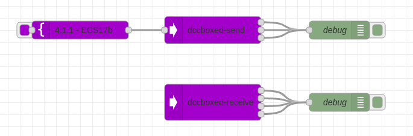

#### Node `duis-template`

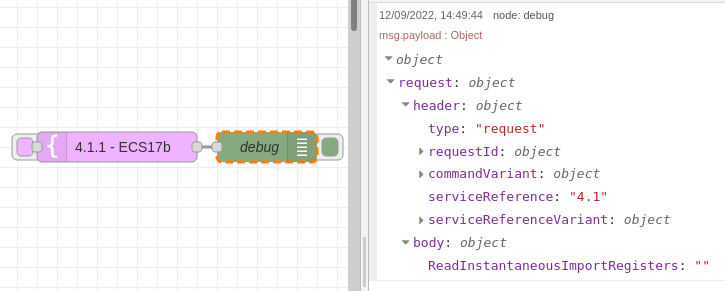

The `duis-template` node provides access to a catalog of [DUIS
templates][duis-templates]. The catalog can be searched by keywords or service
requests. The node is used by dragging it to the canvas and then configuring its
properties in the usual way.

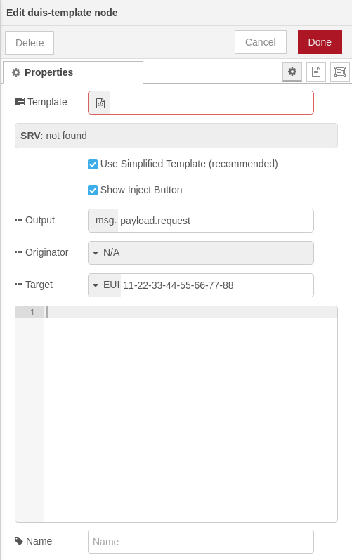

  * The option to use "*Simplified Template*" is highly recommended (and
    required when using `dccboxed-send` node as described below). Information
    about what *simplified* means can be found [here][duis-parser].

  * The *Show Inject Button* option toggles whether the button is displayed on
    the left of the node. This button triggers the node to generate a template.
    Alternatively, the template can be generated in response to an incoming
    message, in which case the *Originator*/*Target* can be extracted from the
    input message.

The following shows an example of searching the catalog:

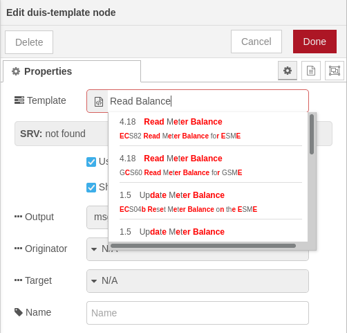

#### Node `dccboxed-config`

The `dccboxed-send` and `dccboxed-receive` node are both dependent on a
`dccboxed-config` node. This node is used to provide a single interface between
DCC&nbsp;Boxed and both `dccboxed-send` and `dccboxed-receive` nodes.

When adding either `dccboxed-send` and `dccboxed-receive` for the first time, it
will be required to configure a DCC&nbsp;Boxed server (as a `dccboxed-config`).


The properties of a `dccboxed-config` are as follows:

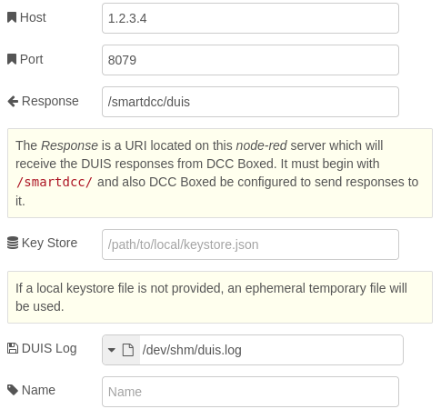

Importantly, ensure the *Host* and *Port* align point to the DCC&nbsp;Boxed
server. The *Response* field needs to be configured on the DCC&nbsp;Boxed DUIS
Interface, so DCC&nbsp;Boxed will be able to correctly send responses. For
example, if NodeRED is running on a machine with IP address `192.168.0.5`,
DCC&nbsp;Boxed could be configured as follows (assuming a default value of
`/smartdcc/duis` in the *Response* field):

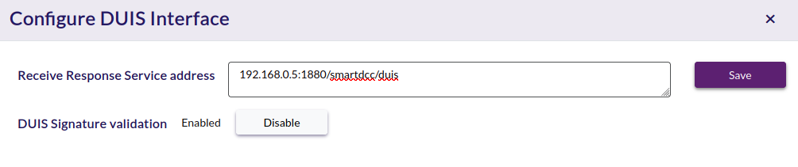

#### Node `dccboxed-send`

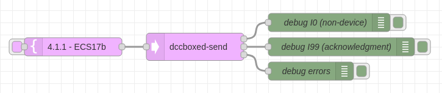

The `dccboxed-send` node provides a fully managed interface to send DUIS
requests to a DCC Boxed instance. This includes:

  * Converting the DUIS request from JSON into XML.
  * Adding an XML digital signature.
  * Transparently handle critical request processing (i.e., call the transform
    service and sign the resulting pre-command).
  * Return synchronous responses.
  * If response is an `I99` (acknowledgement), then store the original request
    (i.e. `msg` object).

#### Node `dccboxed-receive`

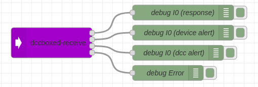

The `dccboxed-receive` node provides a fully managed interface for receiving
asynchronous DUIS responses from a DCC Boxed instance. This includes:

  * Validating the received DUIS response (according to XSD and digital
    signature).
  * Convert XML into JSON.
  * If response contains a GBCS payload, decode and decrypt it.
  * Attempt to reconcile response with request (i.e. stored `msg` object in
    `dccboxed-send`).

The final step of of reconciliation is used so its possible to link asynchronous
responses with the context of the message that triggered the request. For
example, it could link a HTTP request input with its output as the original
`msg` object is preserved. The following shows this, where if a user makes a
http request to the `/trigger` endpoint, it will start a SRV 4.1.1, and once the
response is obtained it is sent to the http client that make the request to
`/trigger`.

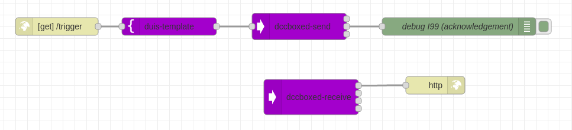

Please note, when the `msg` object is reconciled it is only shallow copied. E.g.
if there are multiple `dccboxed-receive` nodes (see below), each could receive a
copy of the same `msg.payload`, resulting in changes by one node in
`msg.payload` being observed unexpectedly in a different flow. If a deep copy is
required, this will need to be done in any of the nodes downstream from
`dccboxed-receive`.

It is also possible to have multiple `dccboxed-receive` nodes. This allows for
responses of different service requests or alerts to be processed by different
parts of the NodeRED flow (or different flows). The following two screen shots
demonstrate this, where the first one only will receive the response to a 4.1.1
service request and the second node will receive all device alerts.

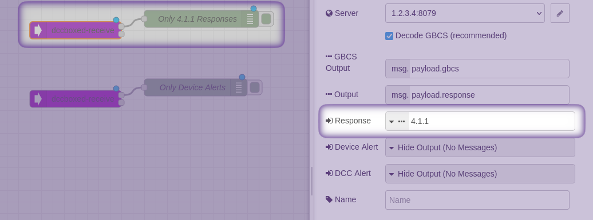

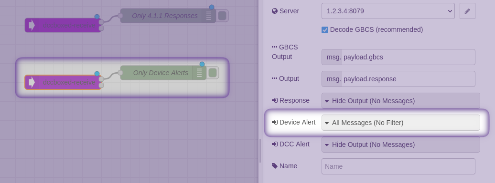

### Advanced

The above high level nodes automate the sending and receiving of DUIS requests
and responses. However, if lower level access to the functional primitives are
required this is provided by the following nodes:

  * `duis-construct` - convert a JSON version DUIS into XML.
  * `duis-parser` - convert an XML DUIS into JSON.
  * `duis-sign` & `duis-validate` - validate the input XML against the DUIS.
    schema and either add XML digital signature, or remove the signature.
  * `gbcs-parser` - parse a GBCS message into JSON, includes ability to decrypt
    (where needed) and validate signatures (where available).
  * `gbcs-signer` - adds a signature to a GBCS pre-command, i.e. outputs a
    signed pre-command.

These blocks are designed to be configurable, and expose many more configuration
options than `dccboxed-send` and `dccboxed-receive`. For instance, the
`gbcs-parser` and `gbcs-signer` allows fine grain control over key material used
and the `duis-parser` can provide raw view of the parsed XML before it is
processed/enriched.

## Reusable Dependencies

This project is a thin wrapper/user interface over a handful of other projects.
These other projects provide the essential functions required to interface with
a DCC&nbsp;Boxed and include:

* [`duis-parser`][duis-parser] - TypeScript library that is capable of encoding and
  decoding DUIS requests and responses.
* [`duis-templates`][duis-templates] - TypeScript collection of RTDS DUIS templates.
* [`dccboxed-signing-tool`][sign] - TypeScript/Java application to sign and
  validate XML signatures required by DCC&nbsp;Boxed.
* [`gbcs-parser`][gbcs-parser] - TypeScript library that can decode GBCS
  messages, validate remote party signatures and sign pre-commands. This library
  is based on the [`HenryGiraldo/gbcs-parser-js`][gbcs-parser-js] parser.
* [`dccboxed-keystore`] - TypeScript library that stores remote
  party/organisation certificates and private keys along with the ability to
  query the SMKI interface on DCC&nbsp;Boxed for device certificates.

These tools are all open source and can easily be reused and assembled into a
tool that interfaces with DCC&nbsp;Boxed as required. See the
[`dccboxed-config.ts`](src/dccboxed-config.ts) file for an example of how they
can be tied together into an application.

## Building and Installing Locally

To build locally, run the following:

```
npm run build
```

This will build both the frontend (using `webpack`) and backend (using `tsc`).
The result will be placed into `dist` folder.

You can then use `npm pack` or `npm link`; afterwards install into the NodeRED
data directory. Typically this will be located at `~/.nodered`.

## Contributing

Contributions are welcome!

When submitting a pull request, please ensure:

  1. Each PR is concise and provides only one feature/bug fix.
  2. Currently project does not have a test suit, however it is expected the
     change is manually tested.
  3. Bugfixes are reference the GitHub issue.
  4. If appropriate, update documentation.
  5. Before committing, run `npm run lint` and `npm run prettier-check`.

If you are planning a new non-trivial feature, please first raise a GitHub issue
to discuss it to before investing your time to avoid disappointment.

Any contributions will be expected to be licensable under GPLv3.

## Other Info

Copyright 2022, Smart DCC Limited, All rights reserved. Project is licensed
under GPLv3.

[duis]: https://smartenergycodecompany.co.uk/the-smart-energy-code-2/ "Smart Energy Code"
[boxed]: https://www.smartdcc.co.uk/our-smart-network/network-products-services/dcc-boxed/ "DCC Boxed"
[sign]: https://github.com/SmartDCCInnovation/dccboxed-signing-tool "DCC Boxed Signing Tool"
[duis-parser]: https://github.com/SmartDCCInnovation/duis-parser "DUIS Parser"
[duis-templates]: https://github.com/SmartDCCInnovation/duis-templates "DUIS Templates"
[gbcs-parser]: https://github.com/SmartDCCInnovation/gbcs-parser "GBCS Parser"
[dccboxed-keystore]: https://github.com/SmartDCCInnovation/dccboxed-keystore "DCC Boxed Key Store"
[nodered]: https://nodered.org/ "Node-RED"
[palette]: https://nodered.org/docs/user-guide/runtime/adding-nodes "Node-RED: Adding nodes to the palette"
[gbcs-parser-js]: https://github.com/HenryGiraldo/gbcs-parser-js "HenryGiraldo/gbcs-parser-js"
