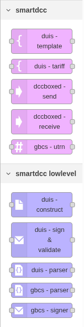
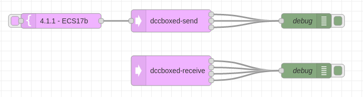
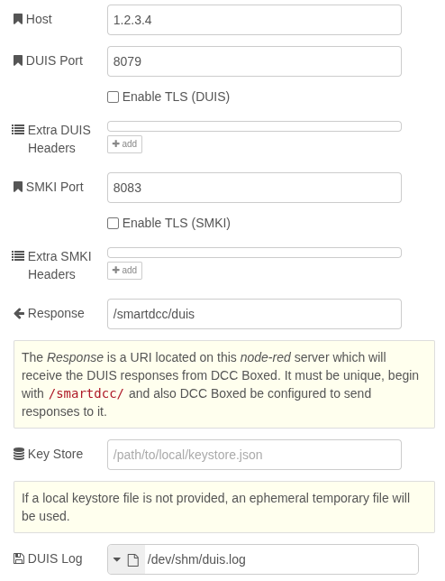
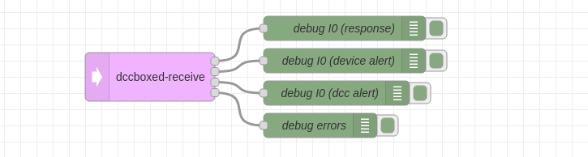
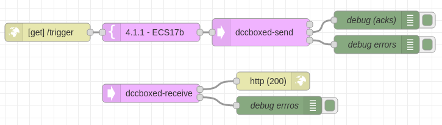

# DCC Boxed Node-RED Nodes

[DCC Boxed][boxed] is a tool for (emulated) end-2-end testing within the UK
smart metering network. This project provides a number of nodes that enable
[Node-RED][nodered] to send and receive requests to a DCC Boxed instance.

The functionality exposed includes:

  * Select a template [DUIS][duis] request from the RTDS library
  * Send the [DUIS][duis] request to a DCC Boxed
  * Receive a [DUIS][duis] response (both synchronous and asynchronously)

## Usage

Install the package into *Node-RED*'s palette using the [standard
process][palette].

This should make a number of nodes available under the `smartdcc` category (see image to right).

To fully use the DUIS signing/validation node it is required to install *Java*
(tested against Java&nbsp;11). This means, that `java` should be available to
the *Node-RED* application, i.e., it is recommended to run *Node-RED* directly
on the host without a sandbox/docker environment. This simplifies the process of
installing `java`. 

  * If running without `java` installed, an error will be generated when the
    sign/validate node is executed.

### Typical Usage

The typical use case of the tool is build around 3 nodes:

  * `duis-template` - Provides template DUIS requests.
  * `dccboxed-send` - Send a DUIS request to a DCC Boxed and output any
    synchronous responses (i.e. the response will likely be an acknowledgement
    or result of a non-device request).
  * `dccboxed-receive` - Asynchronously receive DUIS responses from DCC Boxed
    (i.e. typically will involve response from a device or an alert)

The following shows a minimal setup using these three nodes:

#### Node `duis-template`

The `duis-template` node provides access to a catalog of DUIS templates. The
catalog can be searched by keywords or service requests. The node is used by
dragging it to the canvas and then configuring its properties in the usual way.

  * The option to use "*Simplified Template*" is highly recommended (and
    required when using `dccboxed-send` node as described below). Information
    about what *simplified* means can be found [here][duis-parser].

  * The *Show Inject Button* option toggles whether the button is displayed on
    the left of the node. This button triggers the node to generate a template.
    Alternatively, the template can be generated in response to an incoming
    message, in which case the *Originator*/*Target* can be extracted from the
    input message.

The following shows an example of searching the catalog:

#### Node `dccboxed-config`

The `dccboxed-send` and `dccboxed-receive` node are both dependent on a
`dccboxed-config` node. This node is used to provide a single interface between
DCC&nbsp;Boxed and both `dccboxed-send` and `dccboxed-receive` nodes.

When adding either `dccboxed-send` and `dccboxed-receive` for the first time, it
will be required to configure a DCC&nbsp;Boxed server (as a `dccboxed-config`).

The properties of a `dccboxed-config` are as follows:

Importantly, ensure the *Host* and *Port* align point to the DCC&nbsp;Boxed
server. The *Response* field needs to be configured on the DCC&nbsp;Boxed DUIS
Interface, so DCC&nbsp;Boxed will be able to correctly send responses.

#### Node `dccboxed-send`

The `dccboxed-send` node provides a fully managed interface to send DUIS
requests to a DCC Boxed instance. This includes:

  * Converting the DUIS request from JSON into XML.
  * Adding an XML digital signature.
  * Transparently handle critical request processing (i.e., call the transform
    service and sign the resulting pre-command).
  * Return synchronous responses.
  * If response is an `I99` (acknowledgement), then store the original request
    (i.e. `msg` object).

#### Node `dccboxed-receive`

The `dccboxed-receive` node provides a fully managed interface for receiving asynchronous DUIS responses from a DCC Boxed instance. This includes:

  * Validating the received DUIS response (according to XSD and digital signature).
  * Convert XML into JSON.
  * If response contains a GBCS payload, decode and decrypt it.
  * Attempt to reconcile response with request (i.e. stored `msg` object in
    `dccboxed-send`).

The final step of of reconciliation is used so its possible to link asynchronous
responses with the context of the message that triggered the request. For
example, it could link an HTTP request input with its output as the `msg` is preserved:

### Advanced

The above high level nodes automate the sending and receiving of DUIS requests
and responses. However, if lower level access to the functional primitives are
required this is provided by the following nodes:

  * `duis-construct` - convert a JSON version DUIS into XML.
  * `duis-parser` - convert an XML DUIS into JSON.
  * `duis-sign` & `duis-validate` - validate the input XML against the DUIS.
    schema and either add XML digital signature, or remove the signature.
  * `gbcs-parser` - parse a GBCS message into JSON, includes ability to decrypt
    (where needed) and validate signatures (where available).
  * `gbcs-signer` - adds a signature to a GBCS pre-command, i.e. outputs a
    signed pre-command.

These blocks are designed to be configurable, and expose many more configuration
options than `dccboxed-send` and `dccboxed-receive`.

## Other Info

Copyright 2022, Smart DCC Limited, All rights reserved. Project is licensed under GPLv3.

[duis]: https://smartenergycodecompany.co.uk/the-smart-energy-code-2/ "Smart Energy Code"
[boxed]: https://www.smartdcc.co.uk/our-smart-network/network-products-services/dcc-boxed/ "DCC Boxed"
[sign]: https://github.com/SmartDCCInnovation/dccboxed-signing-tool "DCC Boxed Signing Tool"
[duis-parser]: https://github.com/SmartDCCInnovation/duis-parser "DUIS Parser"
[nodered]: https://nodered.org/ "Node-RED"
[palette]: https://nodered.org/docs/user-guide/runtime/adding-nodes "Node-RED: Adding nodes to the palette"
